### How to Insall Jenkins on EC2 server
- Jenkins is an automation tools used to build deploy your code, CI CD Pipeline.
- #### Create an EC2 Instance
- Now Open you Current running instance Click on the Instance
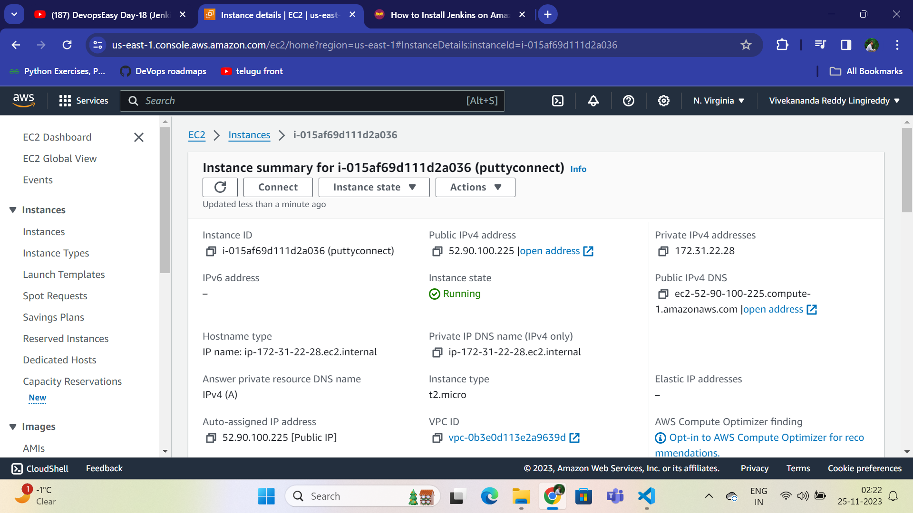
---
Scroll Down click on Security 
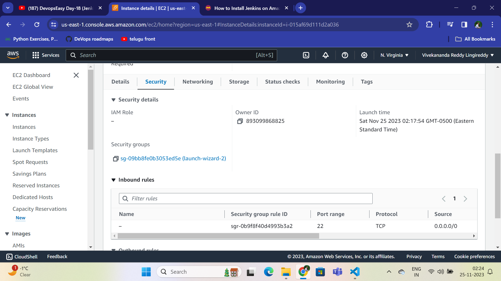
###### Click on  Security Groups
- Edit InBound Rules to set Access to port 8080 --> Jenkins port Number
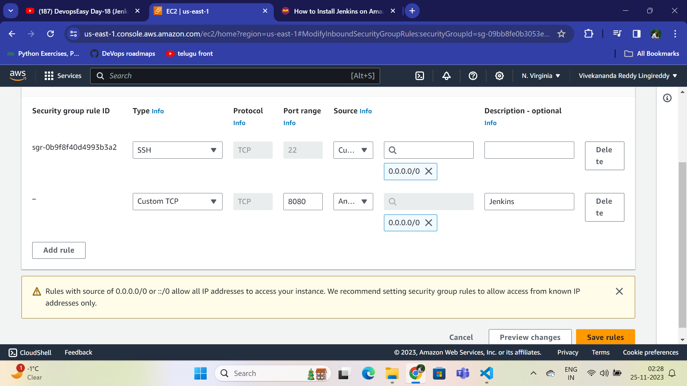
Save the changes  
Now we gave Access to the Jenkins, Connect to Ec2 instance to install Jenkins  
### Connect to EC2 instance 
Click on connect, SSH client to Access with SSH like bash etc. 
Type `chmod 400 <key_pair_name>.pem`  here in bash. vivekcloud is Keypair.  
To Connect to SSH Type  `ssh -i "vivekcloud.pem" ec2-user@ec2-52-90-100-225.compute-1.amazonaws.com`  
Now Your Connected to your Instance 
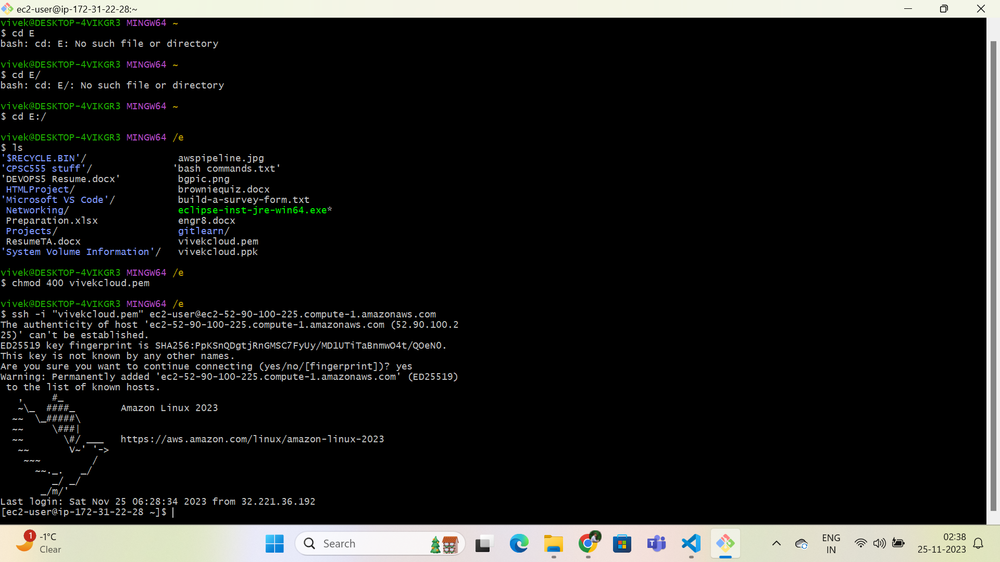

Now to install Jenkins before that check the instance is upto date by typing 
`sudo dnf update`
- 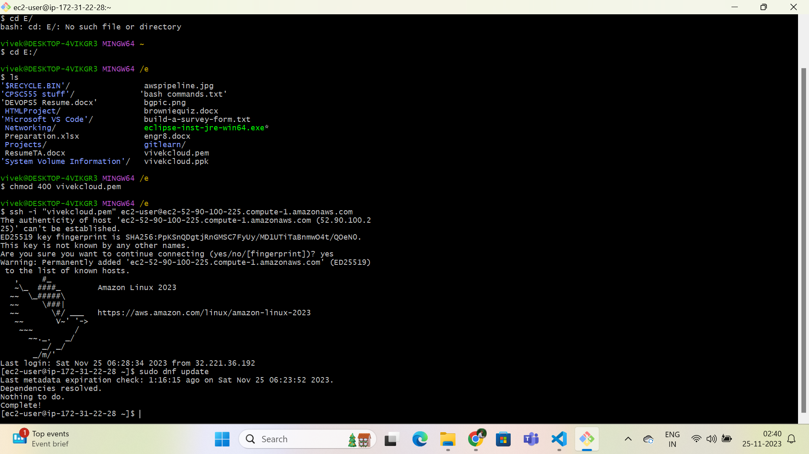
- Jenkins is built on Java Environment so we need to install java first so type  
 `sudo dnf install java-11-amazon-corretto -y`  
 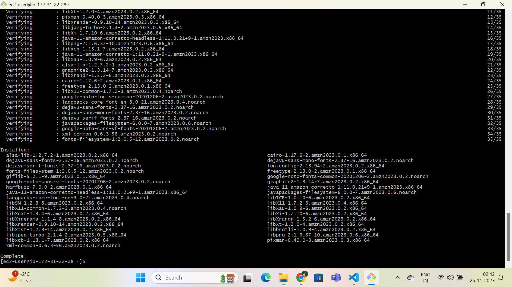  
 - Jenkins is not available on ALI so we need to install from external site we use `wget`  
 `sudo wget -O /etc/yum.repos.d/jenkins.repo \https://pkg.jenkins.io/redhat-stable/jenkins.repo`  
 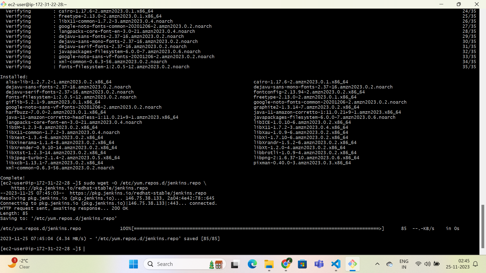
 - Jenkins is downloaded from external site now we need to install it.
 - `sudo rpm --import https://pkg.jenkins.io/redhat-stable/jenkins.io-2023.key`
 - Type `sudo yum install jenkins -y` to install jenkins or `sudo dnf install jenkins -y`
 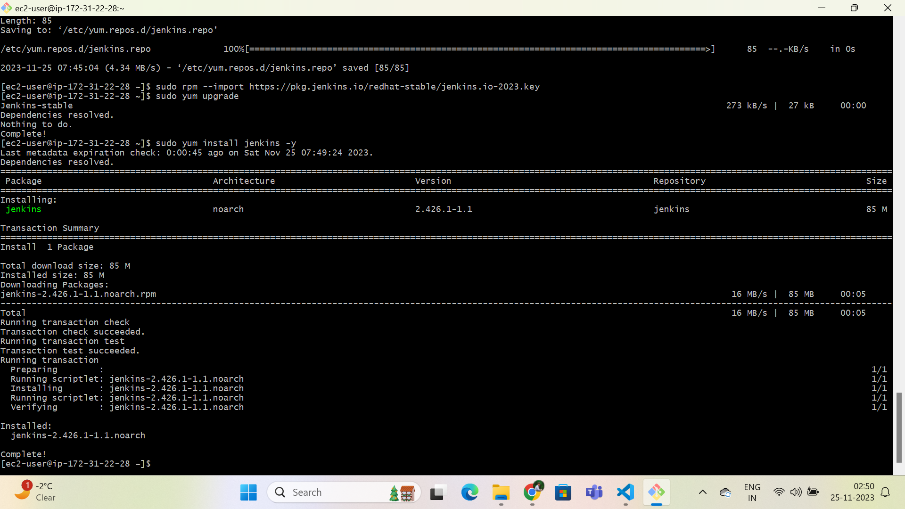  
 - To verify jenkins installed type `jenkins --version `. To start the service type  
  `sudo systemctl start jenkins`  
  - To enable jenkins everytime your system reboots type `sudo systemctl enable jenkins`
  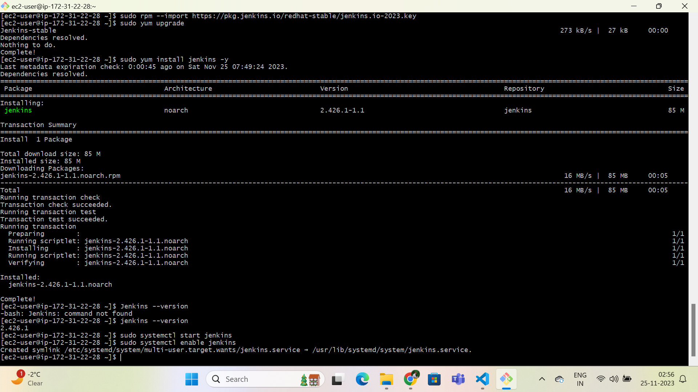

  - Now Jenkins is Successfully installed on EC2 to verify it type `http://yourpublicip:8080`
  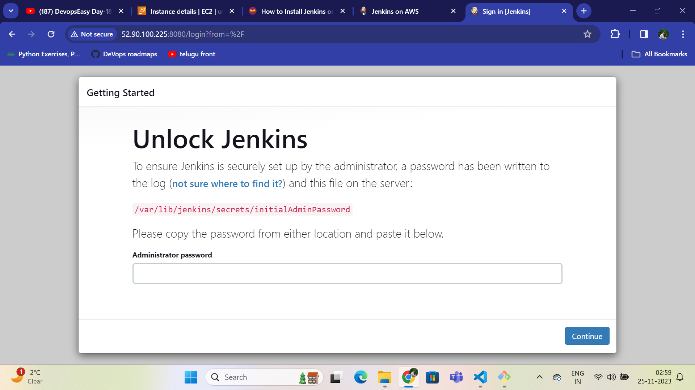  
  - It is asking for the key that is shown at the path provided, its intial key to validate  
  - To view it type `sudo cat /var/lib/jenkins/secrets/initialAdminPassword`  
  - Install all the suggested Plugins 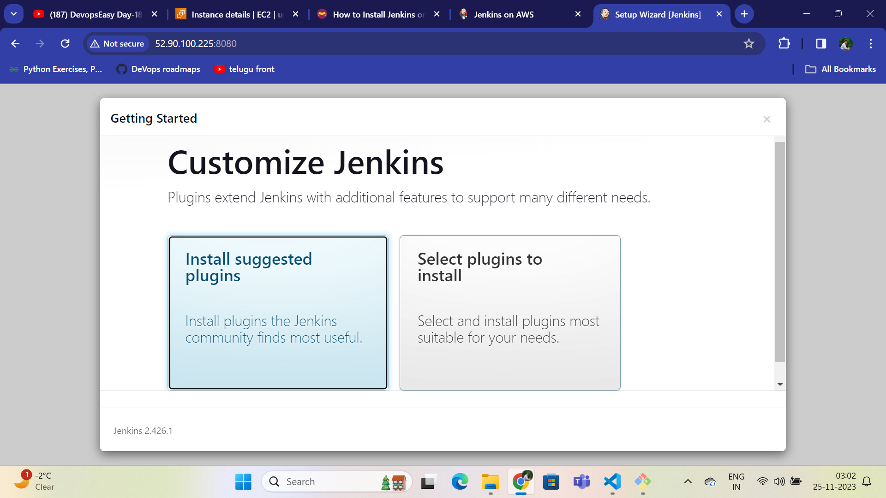  
  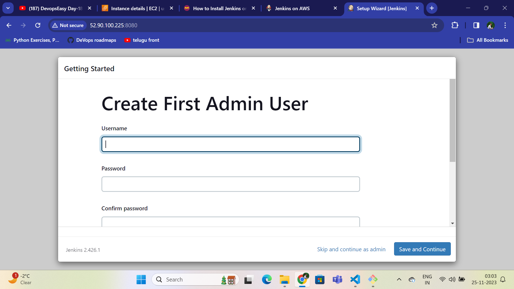 Create the user
  - Now you are ready to use Jenkins at your IP:8080.  
  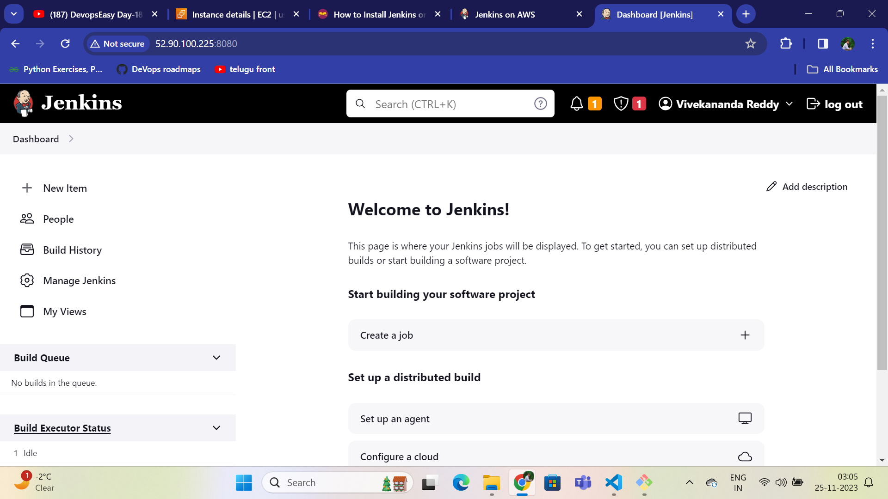
  