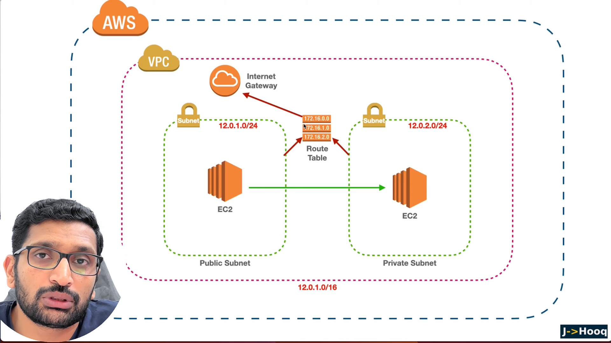

### Aws VPC Virtual Private Cloud
- Virtual Private cloud is a isolated data center with all the resources that scalable and can be launced in multiple Availability Zones. 
- Creating a Seperate data center Virtually that has all the subnets connected to internet gateway to enable  
 traffic to subnets along with adding route tables to get connected to subnets that has source and destination addresses. 
- Subnets: Sub Networks are commonly called as subnets. Subnets  are sub networks  of an Large Internet Network. 
- Subnets can be launced in multiple Availability Zones to decrease Downtime/ latency and also for fault  
 tolerance. 
- Public subnets has traffic enabled to internet  

- private subnets are connected only to outside world to get updates and installation purpose. Its like one  
 way traffic, where private networks can access outside world but not outside world accept private subnets. 
 primarly used to place your data base and application servers inside with no internet access. ex bastion

- In VPC we can use NACl Network access control lists for the subnets as additional security like a firewall. However each instance has its security groups that act as fire wall. 

- [aws vpc ](https://aws.amazon.com/vpc/features/)

# Amazon Virtual Private Cloud (VPC) Features

Amazon Virtual Private Cloud (VPC) offers a range of powerful features that enable users to create a virtual network environment in the AWS cloud. Some of the key features include:

## Networking Features

### Custom Networking Configurations
- **Subnets:** Divide your VPC IP range into one or more subnets to manage resources efficiently.
- **Route Tables:** Control the traffic leaving and entering subnets.

### Network Access Control
- **Security Groups:** Act as virtual firewalls for your instances, controlling inbound and outbound traffic.
- **Network Access Control Lists (ACLs):** Provide an additional layer of security at the subnet level.

### Connectivity Options
- **Internet Gateway:** Enable internet access for your VPC resources.
- **Virtual Private Gateway:** Establish secure connections between your VPC and on-premises infrastructure.
- **AWS Direct Connect:** Set up dedicated network connections between your network and AWS.

## Security Features

### Isolation & Protection
- **VPC Endpoints:** Privately connect your VPC to supported AWS services without needing an internet gateway or NAT device.
- **VPC Peering:** Connect VPCs together to share resources without exposing the traffic to the public internet.

### Encryption & Security Measures
- **AWS Key Management Service (KMS):** Manage encryption keys to encrypt data.
- **Network Segmentation:** Implement multiple layers of security to isolate critical resources.

## Management & Monitoring

### Visibility & Control
- **Amazon CloudWatch:** Monitor your VPC's performance, including network traffic and resource utilization.
- **VPC Flow Logs:** Capture information about IP traffic going to and from network interfaces.

### Resource Management
- **Elastic IP Addresses:** Static IP addresses designed for dynamic cloud computing.
- **VPC Sharing:** Share parts of your VPC resources with other AWS accounts securely.

## Conclusion

Amazon VPC provides a robust suite of features that empower users to build secure, isolated, and highly customizable network environments within the AWS cloud infrastructure.

-   

- above picture shows creation of VPC that is connected to internet.  
- First we will create a VPC 
- [Virtual Private Cloud Installation](E:\Projects\DevOps\Prep\How to Setup VPC on AWS Quickly.pdf)

